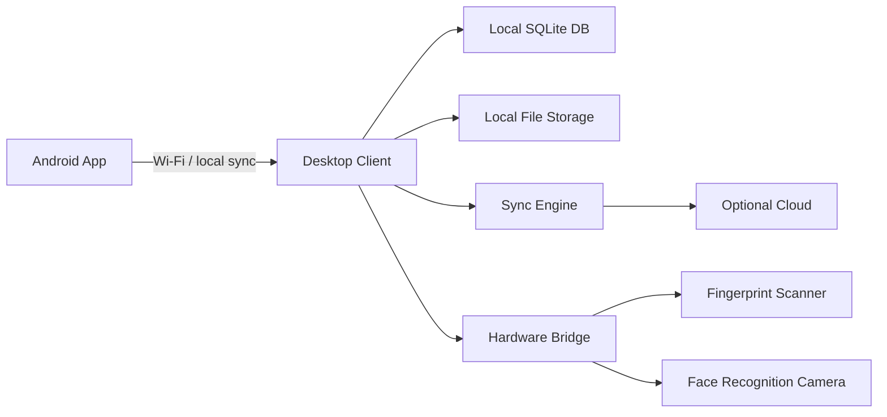
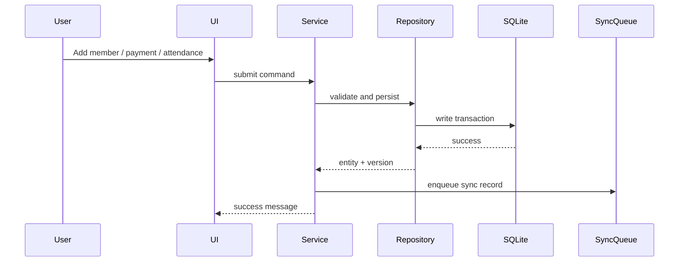

# Architecture overview

## 1. Product architecture

GYM ERP is designed around three operational layers:

- Local desktop hub for the gym
- Android client for mobile operations
- Optional cloud layer for backup and remote access

The local desktop application remains the primary system of record for normal operations. The mobile app mirrors the same data model and syncs with the desktop hub over local Wi-Fi when available, or later through an optional cloud bridge.

## 2. Architectural principles

### Offline-first

All critical workflows record data locally before any remote sync is attempted. The user experience is immediate, even without internet.

### Local authority

The desktop PC acts as the authoritative data hub for core operations. That keeps the ERP usable in unreliable network conditions and reduces dependence on external providers.

### Optional cloud

Cloud integration is additive. The basic product remains fully functional without a paid service or external database.

### Hardware abstraction

The core business logic is not coupled to a single scanner or camera vendor. Each hardware interface exposes a stable contract and the implementation is supplied by a vendor-specific adapter.

## 3. Monorepo structure

The project uses a TypeScript monorepo to separate concerns by domain and runtime:

- apps/desktop: desktop runtime and local-first UI
- apps/mobile: Android runtime and mobile UX
- apps/optional-web: future web administration layer
- packages/shared-types: shared domain contracts, enums, and constants
- packages/database: SQLite access, migration tooling, and local file paths
- packages/business-logic: domain services, first-run setup, and transaction orchestration
- packages/security: hashing, auth, and RBAC primitives
- packages/validation: safe input validation and parsing
- packages/sync-engine: sync record generation, conflict detection, and retry logic
- packages/hardware: biometric device adapters and hardware contracts
- packages/ui: design tokens, navigation, and reusable UI primitives
- services/sync: local sync service and sync queue worker
- services/backup: backup generation and retention management
- services/optional-cloud: later cloud aggregation and object storage integration

## 4. Business layer flow

## 5. Data model strategy

The data model is normalized and keeps file references separate from database records. Photos, documents, receipts, and backups are stored in application-managed folders while the database keeps the file paths and metadata.

This pattern keeps the database lean and avoids storing large binary content directly as database BLOBs.

## 6. Synchronization model

Each important operation writes a local record first and then enqueues a sync entry. Sync records carry:

- entity type
- entity id
- operation
- device id
- version
- timestamp
- status
- retry count
- error information

This supports create, update, and delete flows with automatic retries and conflict resolution.

## 7. Security model

- Passwords are hashed and never stored in plaintext
- Role-based access control provides least-privilege authorization
- Audit logs record major operations and biometric management actions
- Sensitive biometric data is stored locally and protected by device/file access policies
- Secrets are sourced from environment variables, not hard-coded values

## 8. Hardware abstraction model

The hardware layer is intentionally decoupled from the ERP core:

- Camera interface
- Fingerprint scanner interface
- Face recognition interface
- QR/barcode reader interface
- Receipt printer interface

Each device adapter can be implemented with a vendor SDK or a simulator for local development.

## 9. First-run setup

The application is designed for a non-technical user and includes a guided first-run wizard:

1. Gym name
2. Admin account
3. Gym logo
4. Currency
5. Membership plans
6. Finish setup

That setup creates the base data model, default payment methods, default expense categories, and the first admin user.

## 10. Phase 1 status

Phase 1 establishes the architecture contract and implementation foundation. The repository now includes explicit workspace packages for the desktop app, Android mobile app, optional web expansion path, shared packages, and background services.

The app packages intentionally stay dependency-light in Phase 1. Tauri, React, React Native, Expo/native modules, and installer tooling are introduced in their dedicated implementation phases so the architecture can be typechecked without heavyweight runtime dependencies.

Phase 1 is considered complete when the monorepo can be installed, typechecked, and tested from the root while preserving these boundaries:

- `apps/desktop` owns the local PC hub, desktop navigation, installer path, and local service startup.
- `apps/mobile` owns Android-first mobile workflows, local SQLite, camera capture, offline queueing, and sync visibility.
- `apps/optional-web` remains a future optional cloud surface and is not required by the installed local product.
- `packages/*` owns cross-runtime domain, data, security, sync, validation, hardware, and UI foundations.
- `services/*` owns background sync, backup, and optional cloud bridge behavior.
